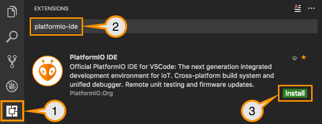
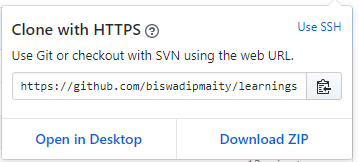
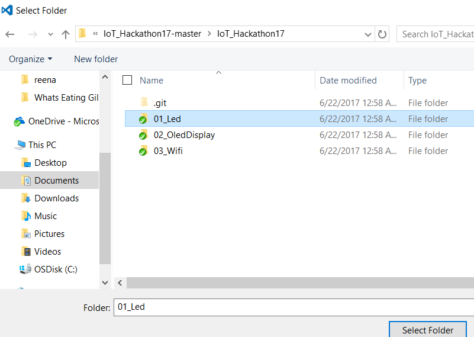

# Introduction to Internet of Things
This repo houses all the examples that we will use for the IoT workshop. You will need VScode IDE along with Platform IO Core(which is a multiplatform build system).
## Installation instructions
IDE Setup

1. Please Download the latest Python 2.7 and install it from https://www.python.org/ftp/python/2.7.13/python-2.7.13.msi. 
DON’T FORGET to select Add python.exe to Path feature on the “Customize” stage, otherwise Python Package Manager pip command will not be available.
2. Visit https://code.visualstudio.com/ and download VS Code, if you don't have it.
3. Open VSCode Package Manager (Click on the extensions icon on the left panel in the IDE)

4. Search for official platformio-ide package (by PlatformIO.org) and install it.
Do not install the one by Jun Han

Reference : http://docs.platformio.org/en/latest/ide/vscode.html#installation

## Sample project setup
1. Clone the repository from https://github.com/biswadipmaity/learningseries / or
download and extract the contents to location of your choice.

2. In VSCode, navigate to the folder in step 1. and select it in the file chooser dialog. (File>Open
Folder> Select Folder)

3. [Optional Step]
4.	Compile the project (Ctrl+Alt+B)
5.	Upload the binary to your device (Ctrl+Alt+U)
